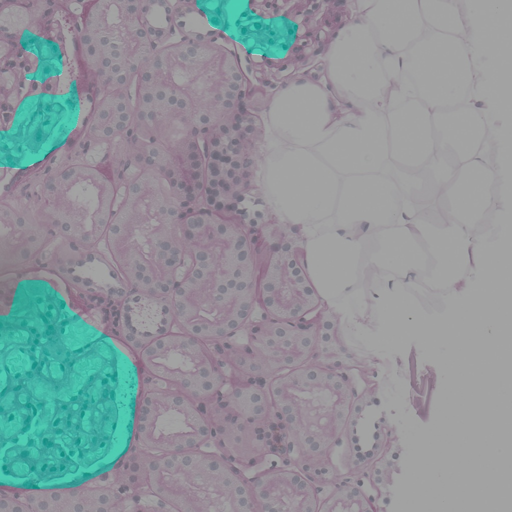
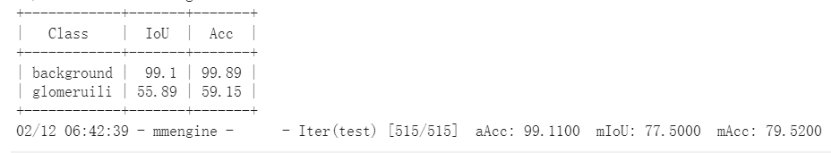
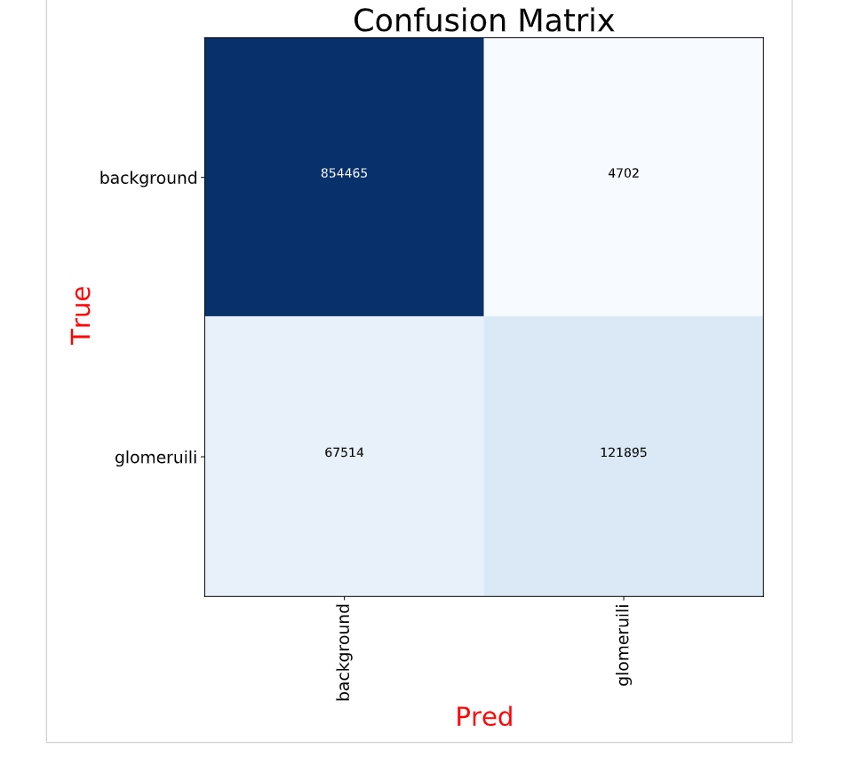
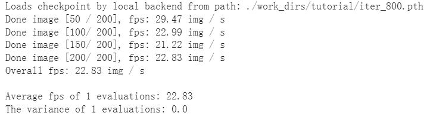

#本次作业是在Google Colab平台上实践mmseg算法库

##数据集来源(肾小球分割数据集)
```bash
!wget https://zihao-openmmlab.obs.cn-east-3.myhuaweicloud.com/20230130-mmseg/dataset/Glomeruli-dataset.zip
```

##作业代码
本次代码大部分都是基于**同济子豪兄**在mmseg实战中使用的代码[mmseg_tutorials](https://github.com/TommyZihao/MMSegmentation_Tutorials/tree/main/20230206)

由于我是在colab上进行实验，不能同时打开多个notebooke文件，所以为了简单起见我将本次实验中所使用的代码整理以后放入**code/mmseg_tutorials.ipynb**文件中，有需要的同学可以自行下载

##模型参数文件以及logs
[模型参数](https://drive.google.com/file/d/1L3pmMeMQWILpk-h92hWeqs6Fa4FGkxHF/view?usp=share_link)
训练过程中的log日志放在文件夹**log**中。

##模型验证
在这一部分将分为4块进行验证：
1. 单张照片结果展示
   
2. 在测试集中的正确率
   
3. 混淆矩阵
   
4. 在视频文件中处理分割问题的速度
   